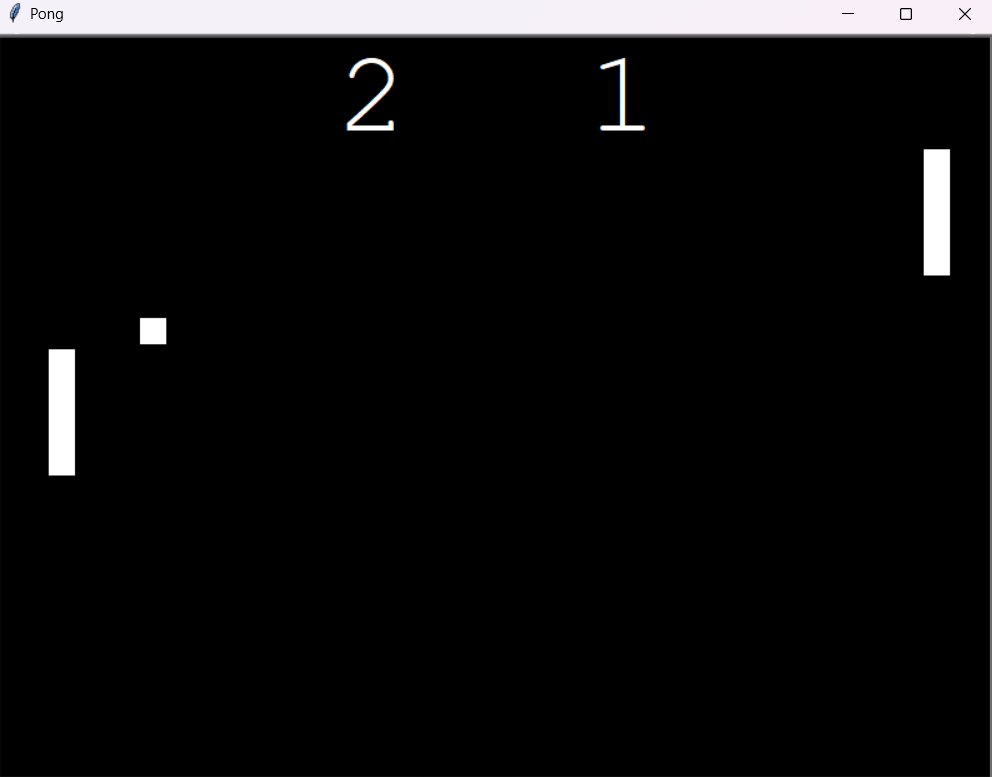

# Python Pong Game

### This is a simple pong game create using python and the turtle module.
### This is a game for 2 players using the same keyboard
### Player 1 moves with the 'W' and 'S' keys.
### Player 2 moves with the '↑' and '↓' keys.



## Installation 
```
git clone https://github.com/ShayCohenn/Python-Pong-Game.git
```
```
cd Python-Pong-Game
```
```
py main.py
```